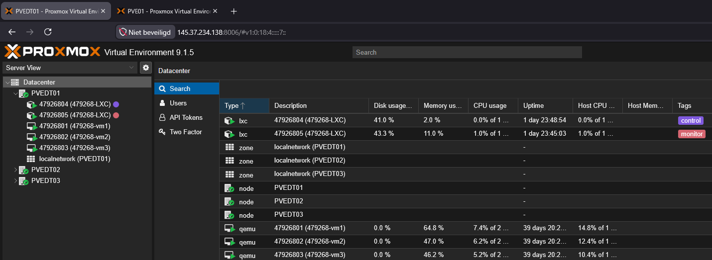
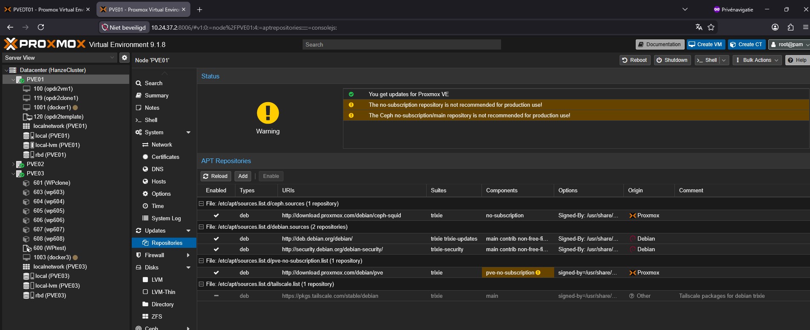
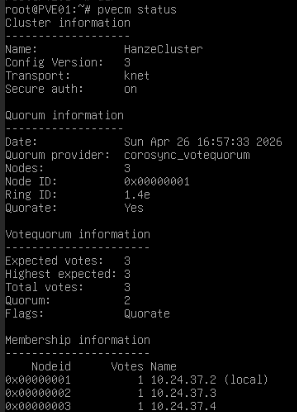
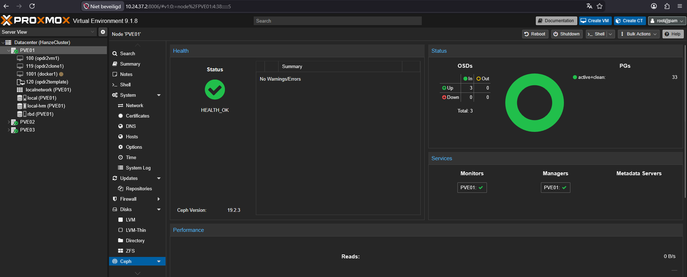
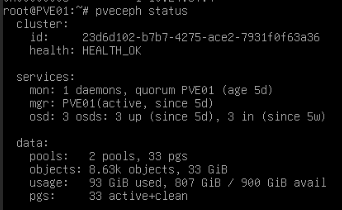

# 1. Proxmox cluster opzetten en monitoren:
Je bent verantwoordelijk voor het opzetten van het Proxmox cluster en het
implementeren van monitoring-tools om de status van het cluster en de applicaties te
bewaken.

## Proxmox Configuratie
- gateway 10.24.36.1

- 47926804 (479268-LXC) 10.24.36.10 Gebruikt als controlnode om via ansible de 3 VM's aan te sturen.
- 47926805 (479268-LXC) 10.24.36.11 Gebruikt als monitoring node voor prometheus + grafana. [Monitornode opzetten](monitornode.md)

- 479268 (479268-vm1) -> PVE01 10.24.36.2
- 479268 (479268-vm2) -> PVE02 10.24.36.2
- 479268 (479268-vm3) -> PVE03 10.24.36.3

### Repositoryaangepast.

### Cluster gemaakt.

### Ceph status.

