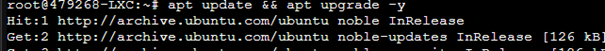
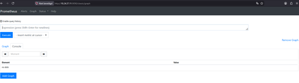
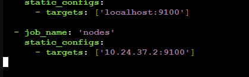
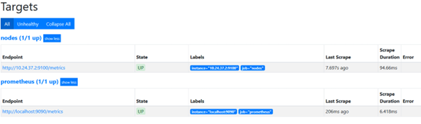
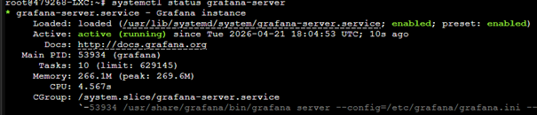
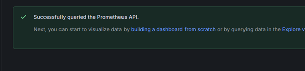
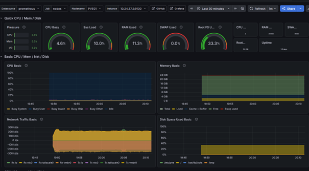

## Opzetten van monitornode (Prometheus + Grafana)

### Systeem geüpdatet en voorbereid op installatie van monitoring tools:

### Prometheus webinterface bereikbaar gemaakt en succesvol geopend in de browser:

### Prometheus configuratie aangepast om een externe node exporter toe te voegen als target:

### Prometheus targets gecontroleerd en bevestigd dat zowel de node exporter als Prometheus zelf succesvol data verzamelen (status UP):

### Grafana service gestart en gecontroleerd dat deze actief draait op de monitornode:

### Grafana succesvol gekoppeld aan Prometheus en verbinding getest via de API:

### Grafana dashboard geïmporteerd en succesvol metrics (CPU, geheugen, netwerk en disk) van de node weergegeven:

