# Deelopdracht 1

## Opdrachten: Tutorial simplilearn https://www.simplilearn.com/tutorials/docker-tutorial
## Lesson 4 - Installeer op een Proxmox node een Ubunbtu host (bijvoorkeur VM) met daarop Docker.Registreer van alle lessons de uitkomsten met een screen recording/screenshots en leg het vast in je repository.

### Poging gedaan om op elke node (PVE01 .101, PVE02 .102, PVE03 .103) een ubuntu VM aan te maken. Deze lopen continu vast bij de setup. Lag waarschijnlijk aan de toegewezen 1gb ram i.p.v. 6 Wel weer een uur verder.
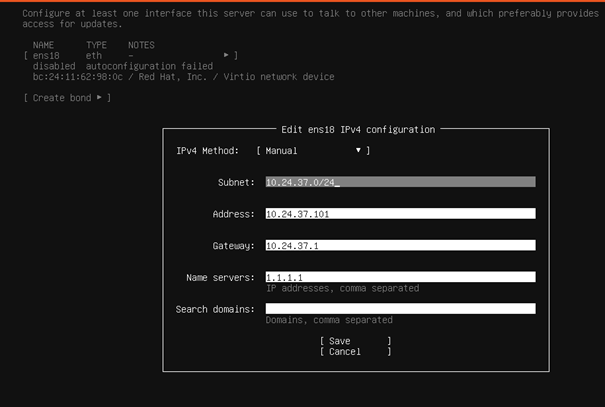

### Benodigde packages geïnstalleerd voor Docker (ca-certificates en curl):
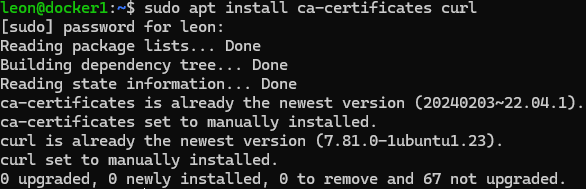

### Docker GPG key toegevoegd en rechten ingesteld:
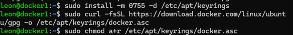

### Docker repository toegevoegd aan APT sources:
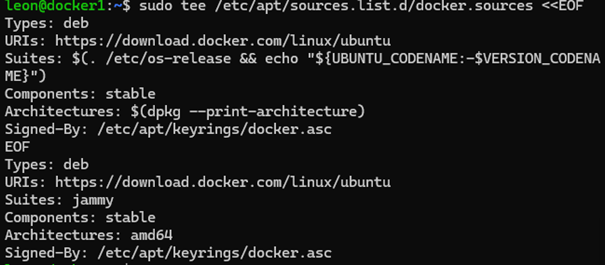

### APT package lijst geüpdatet na toevoegen van Docker repository:
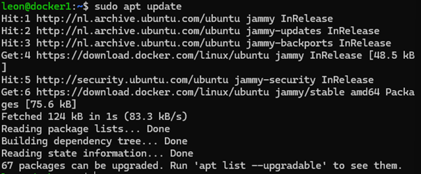

### Docker service gecontroleerd, draait succesvol op de VM:
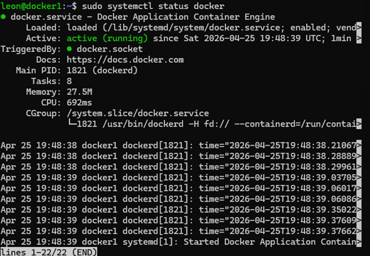

### Docker versie gecontroleerd om installatie te verifiëren:
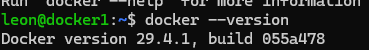

### Docker installatie getest met hello-world container, succesvol uitgevoerd:
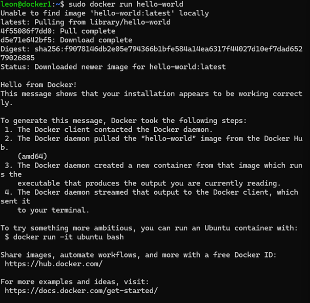

### Overzicht van beschikbare Docker images gecontroleerd:
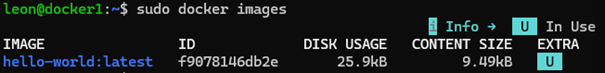

### Overzicht van alle containers weergegeven, inclusief gestopte containers:
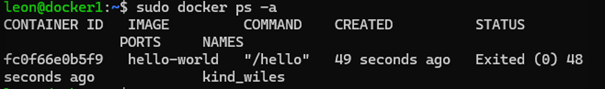

## Lesson 7 - Build Image with DockerFile and create new Container op elk docker instantie op het Proxmox cluster.

### Directory aangemaakt en Dockerfile voorbereid voor het bouwen van een image:
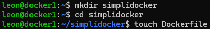

### Dockerfile aangemaakt met basisconfiguratie voor een custom image:
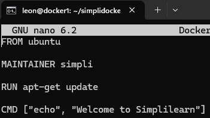

### Docker image gebouwd op basis van de Dockerfile:
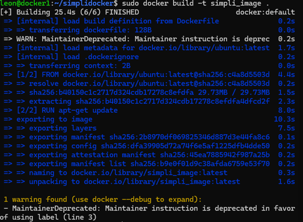

### Container gestart vanuit zelfgemaakte Docker image en output gecontroleerd:
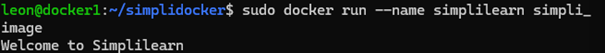

## Lesson 8 - Docker Compose install op alle 3 Docker installaties op het Proxmox cluster.

### Docker Compose installatie gecontroleerd door versie op te vragen:
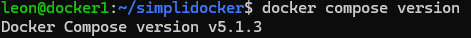

### Docker Compose configuratie aangemaakt met meerdere services (app en database):
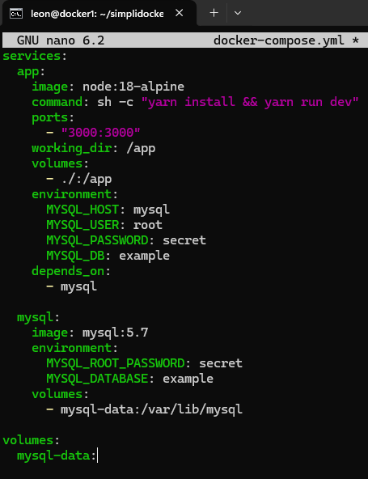

### Docker Compose stack gestart met meerdere services (app en database):
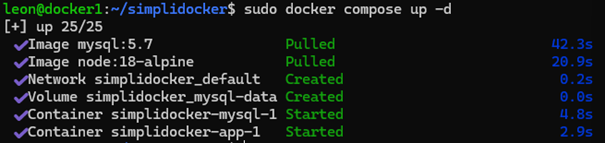

### Actieve containers gecontroleerd om te bevestigen dat de services draaien:
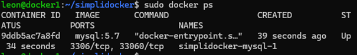

### Logs van de database container bekeken om te controleren of MySQL correct is opgestart:
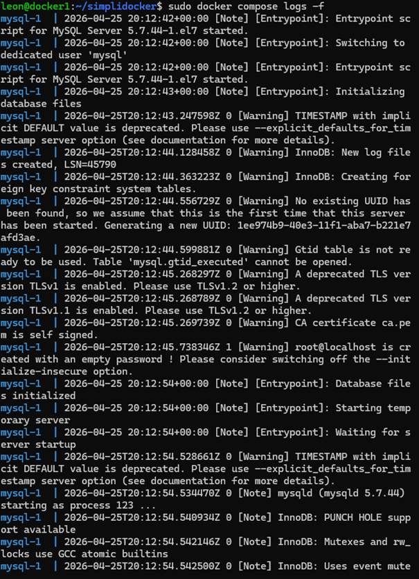

## Lesson 9 - Voer, vanaf stap 6, geautomatiseerd de stappen uit op alle Docker omgevingen op het Proxmox cluster. Met als resultaat 3 swarms met 3 manager(op elke procmode node 1)

### Ansible playbook aangemaakt voor het automatiseren van Docker Swarm configuratie:
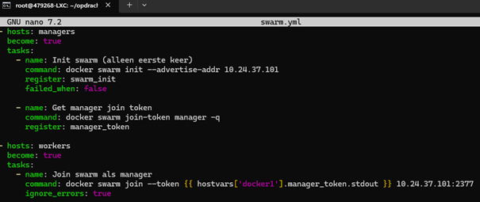

### Ansible playbook uitgevoerd om Docker Swarm automatisch te configureren op alle nodes:
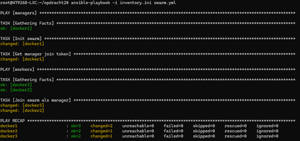

### Overzicht van Docker Swarm nodes gecontroleerd, alle nodes succesvol toegevoegd:
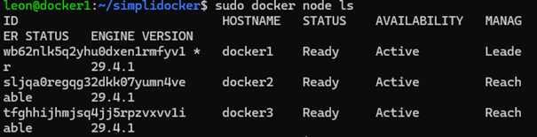

### Docker Swarm status gecontroleerd, swarm is actief:
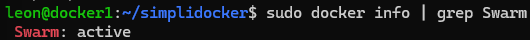

## Lesson 10 - "Basic Docker Neworking Command" Zet de commando's in een script en laat het script de commando's een voor een uitvoeren.

### Shell script aangemaakt met basis Docker networking commando’s:
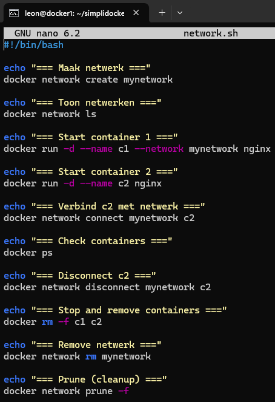

### Docker networking script uitgevoerd om netwerk en containers automatisch te beheren:
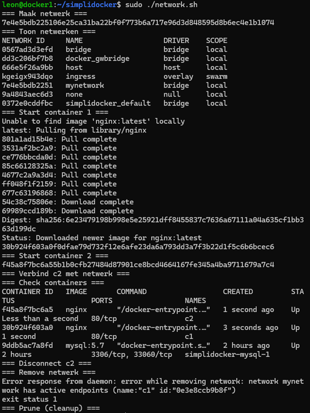