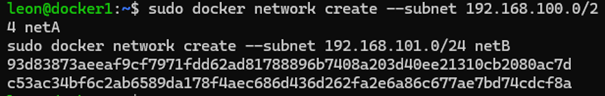
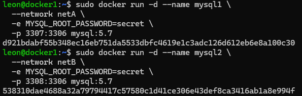
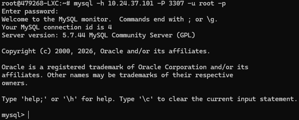
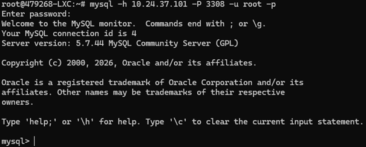
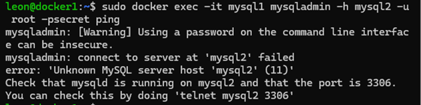
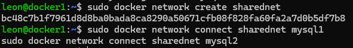
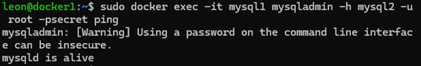

# Deelopdracht 2

## Zet twee MySQL ( lesson8 van opdracht 1) Zet elke server in een apart subnet. Controleer of je vanuit jouw eigen subnet (waar ook de Proxmox nodes opstaan), je de MySQL containers kunt benaderen en of de servers elkaar kunnen benaderen. Mocht dat niet lukken pas dan de setting aan zodat wel kan, script deze. Maak een korte beschrijving hoe je meerdere subnetten kunt creëren met Docker en waarom dit nuttig kan zijn. Plaats deze ook op je repository.

### Werken met meerdere subnetten in Docker

In Docker kun je meerdere subnetten creëren door aparte netwerken aan te maken met een eigen IP-range. Dit doe je met:

docker network create --subnet <subnet> <netwerknaam>

Elke container die je aan zo’n netwerk koppelt, krijgt een IP-adres binnen dat subnet. Containers in hetzelfde netwerk kunnen direct met elkaar communiceren, terwijl containers in verschillende netwerken standaard van elkaar geïsoleerd zijn.

### Waarom dit nuttig is

Het gebruik van meerdere subnetten heeft verschillende voordelen:

- **Beveiliging**: containers zijn van elkaar gescheiden en niet direct bereikbaar  
- **Structuur**: je kunt applicaties opdelen in bijvoorbeeld frontend-, backend- en database-netwerken  
- **Isolatie**: problemen in één netwerk hebben minder impact op andere onderdelen  
- **Controle**: je bepaalt zelf welke containers met elkaar mogen communiceren  

Als communicatie tussen subnetten nodig is, kun je een container aan meerdere netwerken koppelen. Deze container fungeert dan als verbindingspunt tussen de subnetten.

### Twee Docker netwerken aangemaakt met verschillende subnetten:

### Twee MySQL containers gestart, elk in een apart subnet:

### Verbinding gemaakt met MySQL container vanaf de host via gepubliceerde poort:

### Verbinding gemaakt met tweede MySQL container vanaf de host via andere poort:

### Test uitgevoerd tussen containers, verbinding mislukt doordat ze in verschillende subnetten zitten:

### Extra netwerk aangemaakt en beide containers gekoppeld om communicatie mogelijk te maken:

### Test opnieuw uitgevoerd, containers kunnen nu met elkaar communiceren:

