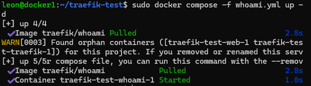
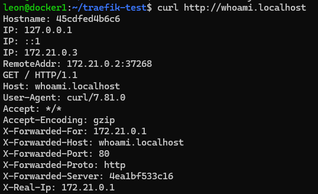
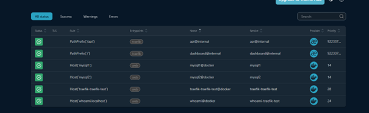
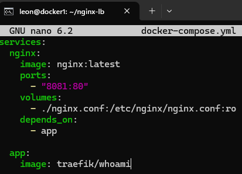
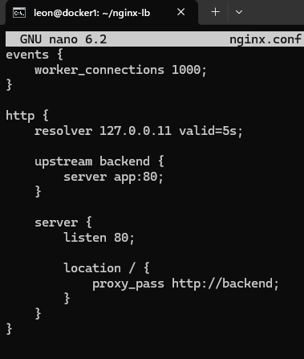
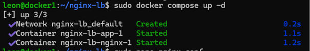
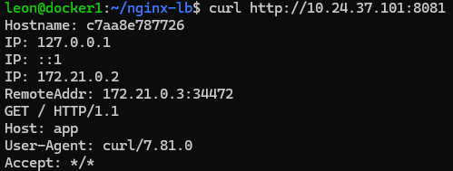
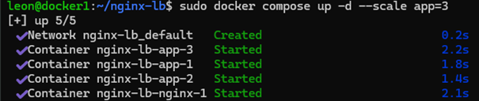
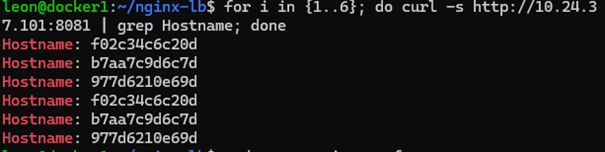

# Deelopdracht 3

## Opdrachten: Load Balancing en Reverse Proxy
1. (2pt) Maak kennis met een product dat bovenstaande verzorgt https://doc.traefik.io/traefik/getting-started/quick-start/
Maak screenshots van de uitkomsten van bovenstaande en leg uit wat een Reverse proxy doet.

Een reverse proxy ontvangt inkomend verkeer en stuurt dit door naar de juiste backend service. De client communiceert dus niet direct met de backend, maar via de proxy.

### Directory aangemaakt:

### Docker Compose bestand gemaakt:

### Traefik dashboard zichtbaar in browser:

### Whoami service toegevoegd:

### Whoami service gestart via Docker Compose:

### Whoami service getest via curl, response succesvol ontvangen:

### Traefik dashboard bekeken, routes en services zichtbaar:

2. Kies een tutorial waarin men in Docker een load balancer/proxy toepast. Met behulp van Nginx. Volg de tutorial en leg per stap je handeling vast in je eigen repository. Voeg een Markdown file toe waarin je een verwijzing maakt naar de gevolgde tutorial. Maak een korte screen recording van de uitkomsten (werking van reverse proxy en scaling/load balancing).

Gekozen tutorial: https://rickt.io/posts/09-load-balancing-a-fastapi-app-with-nginx-and-docker/

### Docker Compose bestand voor Nginx load balancer aangemaakt:

### Nginx configuratiebestand aangemaakt voor load balancing:

### Docker Compose stack gestart voor Nginx load balancer:

### Nginx reverse proxy getest, request succesvol doorgestuurd naar container:

### Applicatie geschaald naar meerdere containers met Docker Compose:

### Load balancing getest, requests worden verdeeld over meerdere containers:

### screenrecording van load balancing in werking.
[Bekijk screen recording](videos/loadbalancing.mp4)