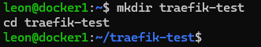
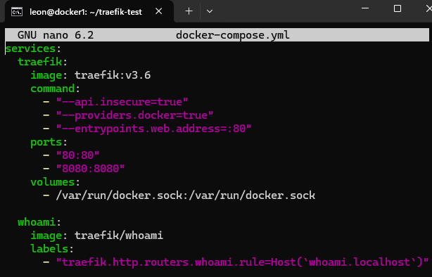
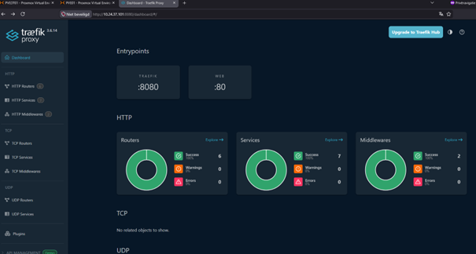
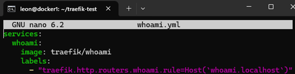

Deelopdracht3

Opdrachten: Load Balancing en Reverse Proxy
1. (2pt) Maak kennis met een product dat bovenstaande verzorgt https://doc.traefik.io/traefik/getting-started/quick-start/
Maak screenshots van de uitkomsten van bovenstaande en leg uit wat een Reverse proxy doet.

Tutorial volgen.
Directory aangemaakt.

Docker-compose.yml aanmaken. 

Dashboard in browser.

whoami.yml aanmaken.
